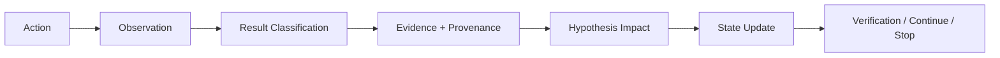

# CTF Agent Trust Kernel — Phase 2

A small, provider-independent Python 3.10 kernel enforcing trustworthy state transitions for
authorized CTF workflows. It **does not solve challenges or execute exploits**. It prevents raw tool
output from directly changing beliefs or verifying flags.

## Mandatory pipeline


## Components
- `models.py` — frozen typed state models and separate enums for result, impact, evidence, and verification.
- `classifier.py` — structured `ExecutionResult` → deterministic `ResultClassification`.
- `impact.py` — classification + test context → conservative `HypothesisImpact`.
- `evidence.py` — classification-bound evidence ledger; current evidence outranks historical memory.
- `hypothesis.py` — immutable hypothesis state updates.
- `failure_memory.py` — lossless read-only normalization/retrieval of Phase 1 failures as advisory priors; append-only runtime JSONL outside `.agent_audit`.
- `verification.py` — trusted-tool proof policies, candidate-bound evidence, STOP-on-verified, anti-spray attempt identity.
- `deduplication.py` — semantic action fingerprint + relevant-state digest and auditable action records.
- `kernel.py` — atomic dedup→observation→classification→evidence→impact→state→verification transition; no executor or planner.
- `regression.py` — deterministic replay of the 12 Phase 1 failure cases.

## Run
```powershell
Set-Location F:\mission-git-hackss\mission-git-hackss\.agent
python -m pytest
python -m compileall -q src tests
```

## Trust guarantees
1. Rate limits, auth/authz, timeout, network, tool, and environment failures cannot automatically disprove a hypothesis.
2. Only an authoritative discriminating contradiction may produce `DISPROVES`.
3. Regex/readability, model suggestions, behavioral matches, and weak-checker collisions cannot verify a flag.
4. Challenge-relevant authoritative or deterministic proof returns `VERIFIED` + `STOP`.
5. Same action + materially same state is `DUPLICATE`; state changes permit retry.
6. Historical failure memory is advisory and cannot override stronger current evidence.
7. Every evidence record requires explicit provenance.

See `docs/design.md`, `docs/deviations.md`, and `docs/historical_failure_regression.md`.
