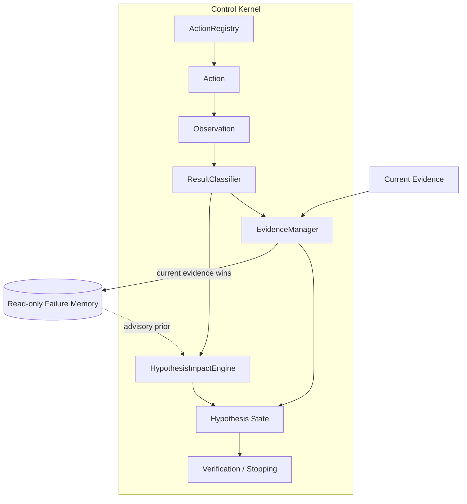

# Phase 2 Design and Rules

## Scope boundary
This package is the deterministic trust/control foundation only. It has no autonomous solver,
executor, specialist routing, LLM provider, MCP framework, UI, database, retry engine, or exploit logic.

## Architecture

## Minimal data schemas
| Model | Required trust-relevant fields |
|-------|--------------------------------|
| `ChallengeState` | id, name, grading model, attempts remaining, revision |
| `EnvironmentState` | revision, available tools, network availability |
| `Hypothesis` | id, statement, status, supporting/contradicting/unresolved evidence, last update |
| `Action` | id, objective, tool, target, input, relevant params, prerequisites, state before/after |
| `ExecutionResult` | exit/stdout/stderr, HTTP, timeout, process/network/tool/environment state, metadata |
| `Observation` | id, action id, timestamp, source, exact execution result |
| `Evidence` | id, action id, timestamp, source, exact observation, result class, status, strength, hypotheses, freshness, provenance |
| `FailureRecord` | normalized Phase 1 fields + root causes + provenance + raw source mapping |
| `FlagCandidate` | value, source, evidence, status, attempts, verified time, rejection reason |
| `VerificationState` | candidates and CONTINUE/STOP decision |

All core records are frozen dataclasses. Classification and hypothesis meaning use different enums.

## Result-classification precedence (what happened)
1. explicit `timed_out` → `TIMEOUT`
2. environment unavailable → `ENVIRONMENT_FAILURE`
3. tool unavailable → `TOOL_FAILURE`
4. structured unreachable network state → `NETWORK_FAILURE`
5. HTTP 429 → `RATE_LIMIT`
6. HTTP 401 → `AUTH_FAILURE`
7. HTTP 403 → `AUTHZ_FAILURE`
8. explicit rejection or HTTP 400/405/406/409/413/415/422 → `INPUT_REJECTION`
9. explicit authoritative success → `SUCCESS`
10. relevant state changed → `STATE_CHANGE`
11. any other HTTP status → `TARGET_RESPONSE`
12. non-zero process exit → `TOOL_FAILURE`; zero → `SUCCESS`
13. insufficient fields → `AMBIGUOUS`

Text may be preserved in the observation, but generic classification does not depend on one magic string.

## Hypothesis-impact rules (what it means)
| Classification/context | Impact |
|------------------------|--------|
| rate limit / timeout / network / tool / environment failure | `UNRESOLVES` |
| auth / authz / input rejection | `BLOCKS_TEST` |
| missing prerequisite | `BLOCKS_TEST` |
| no actual observation | `NO_IMPACT` |
| ambiguous | `UNRESOLVES` |
| successful response alone | `NO_IMPACT` |
| expected observation + authoritative source | `SUPPORTS` |
| contradiction + valid discriminating test + authoritative source | `DISPROVES` |
| same contradiction but non-authoritative | `WEAKENS` |
| explicitly inconclusive valid response | `UNRESOLVES` |

Disproof is intentionally conservative.

## Hypothesis-impact authority
The pure impact function remains separately testable, but the state-mutating kernel does not accept
caller-provided authority booleans. A discriminating `TestSpecification` must be registered *before*
execution and is bound to the semantic action fingerprint. The kernel derives support/contradiction by
matching the exact observation and requires the source to appear in both the test specification and the
composition-time trusted-source map for that action tool. Without such a specification, an ordinary
target response has `NO_IMPACT` and cannot disprove anything. Action ID and tool must also match the
registered action before dedup state is mutated.

## Evidence and freshness
Evidence wraps the exact `Observation` object rather than rephrasing raw output. Current evidence can
only be recorded with a `ResultClassification` that the manager recomputes from that same observation;
mismatches are rejected. Status, strength, freshness, and current provenance are derived internally.
IDs are deterministic SHA-256 prefixes over stable identity fields. Historical priors are always stale,
low-strength, and structurally barred from direct hypothesis updates. When current evidence conflicts
with historical memory, current evidence wins.

## Failure memory
- Loads `.agent_audit/failures/failures.jsonl` read-only.
- Preserves each raw source object in a read-only mapping.
- Normalizes cause aliases (`AUTH`→`AUTH_FAILURE`, `ENV_FAILURE`→`ENVIRONMENT_FAILURE`).
- Adds only transparent loader metadata: `HISTORICAL`, `last_verified=None`, and source-line provenance.
- Missing source fields remain missing/null (`FAIL-012.recovery=None`).
- Retrieval is deterministic category/result-class/keyword matching and returns `advisory_only=True`.
- Runtime failure records can be appended to local JSONL; writes under `.agent_audit` are rejected.
- Empty queries return nothing, preventing bulk context dumps.

## Verification and stopping
Qualifying proof is derived only from current evidence in the evidence ledger and a composition-time
`VerificationPolicy` identifying trusted tool adapters. The exact candidate must occur in output from a
trusted authoritative-output tool *and* the classified result must be eligible (success/target response/
state change); failed execution output cannot verify. Output binding uses exact candidate-token boundaries,
not substring membership. Alternatively, verifier metadata must bind the submitted value and acceptance;
or a trusted deterministic tool must bind candidate, method, basis, and successful validation. Caller-
created flag-like output from an untrusted tool cannot verify. Candidate terminal status is not a
constructor argument, so callers cannot inject `VERIFIED`.

The allowed methods are authoritative verifier acceptance, authoritative challenge output,
deterministic derivation tied to challenge logic, cryptographic proof, grading logic, or a
challenge-specific self-check. These produce `VERIFIED` + `STOP` only through trusted evidence.

Regex/readability, weak-checker collisions, model suggestions, or generic analysis remain
`CANDIDATE`/`SUPPORTED` + `CONTINUE`. Authoritative verifier rejection produces `REJECTED`.

## Anti-spray
Attempt identity = SHA-256(candidate value, verifier, trusted current evidence IDs, computed relevant-
state digest). The registry resolves every evidence ID through the evidence ledger, requires a non-empty
set, checks each record is current and contains/binds the exact candidate, and computes the state digest
itself; invented, unrelated, stale, or historical evidence is rejected. Candidate-bearing kernel actions
must pass this gate using prior evidence before action registration. An identical attempt is `DUPLICATE`.
Candidate, verifier, trusted evidence, or relevant state change permits a new attempt.

## Action deduplication
Action fingerprint includes normalized objective, tool, target, input, relevant parameters, and
prerequisites. It excludes action id and execution metadata. A separate digest covers environment,
authentication, session, and challenge revision. The kernel validates action/execution identity *before*
mutating the registry, then atomically registers the action before any observation is created: same action
+ same state returns `DUPLICATE` with no observation/evidence; meaningful state change is allowed.
Completed actions record result class and state-after.

## Test harness
The suite covers the 15 required cases and eight invariants, all 12 Phase 1 failures, and adversarial
trust-boundary cases. Historical expectations and structured replay inputs are separate fixtures
(`historical_expectations.json` and `historical_replays.json`); production code contains no failure-ID
behavior map. This avoids tautological regression tests.
